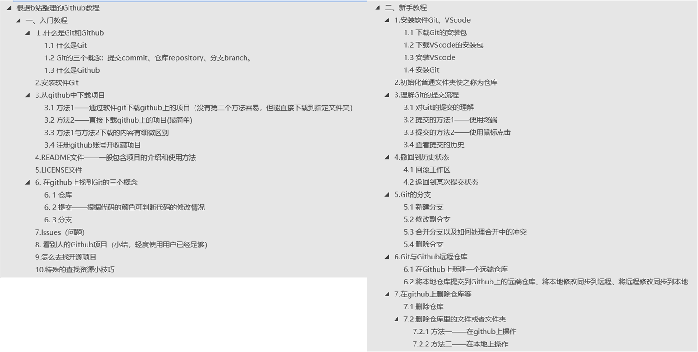

<p align="center"><strong>目录</strong></p>  <!-- 注释:这句代码的效果为加粗居中 -->

- [一、仓库git-github\_learn的介绍](#一仓库git-github_learn的介绍)
- [二、免责声明：](#二免责声明)
- [三、使用说明以及参考来源：](#三使用说明以及参考来源)
- [四、常用命令的记录](#四常用命令的记录)
  - [1.远程连接时的补充](#1远程连接时的补充)
  - [2.VScode书写Markdown文件的插件](#2vscode书写markdown文件的插件)
- [五、补充一些关于gitee的命令](#五补充一些关于gitee的命令)
___  
# 一、仓库git-github_learn的介绍  
&emsp;&emsp;一个分享如何使用git/github的笔记的仓库。  
___  

# 二、免责声明：
&emsp;&emsp;笔记**仅供分享给大家学习使用，不会用作任何商业用途**，如果有人**用作非学习用途构成的侵权行为，与本人无关，请自行承担责任**。   
___  

# 三、使用说明以及参考来源：
&emsp;&emsp;1.本仓库上传了一份关于如何使用git/github的笔记，笔记文件为"**根据b站整理的Github教程.docx**"，大家可以下载阅读。  
&emsp;&emsp;2.该笔记是学习b站up主**冯雨**分享的视频教程[**Github 新手够用指南 | 全程演示&个人找项目技巧放送**](https://www.bilibili.com/video/BV1e541137Tc/?spm_id_from=333.337.search-card.all.click&vd_source=ffb19c330efad3ae5d7d43710d936b1f)、[**40 分钟学会 Git | 日常开发全程大放送&搭配Github而记录的笔记**](https://www.bilibili.com/video/BV1db4y1d79C/?spm_id_from=333.999.0.0&vd_source=ffb19c330efad3ae5d7d43710d936b1f)，笔记来源于本人。**若有侵权，请联系本人删除**。由于本次笔记字数很多，笔误以及错别字可能很常见，若读者发现笔记有错误，欢迎批评指正。  
&emsp;&emsp;3.其他参考链接：[**什么是版本控制？为什么要有版本控制？常用的版本控制工具有哪些？_版本控制是什么意思-CSDN博客**](https://blog.csdn.net/Roaddd/article/details/119800942)、[**github代码比对颜色介绍**](https://blog.csdn.net/qq_43683622/article/details/128170125)、[**删除仓库中的文件**](https://docs.github.com/zh/repositories/working-with-files/managing-files/deleting-files-in-a-repository)。  
&emsp;&emsp;4.本次笔记所包含的内容如下图所示：<br>

&emsp;&emsp;5.笔记对应的Github链接：[git-github_learn](https://github.com/yunyandegit/git-github_learn)。考虑到很多人进入github下载文件非常慢，本人将该笔记也放在码云（即gitee,属于国人自己的git）上了，对应位置：[git-github_learn](https://gitee.com/yuiling/git-github_learn)。<br>
&emsp;&emsp;6.关于如何使用git,码云上也有一份文档：[**Pro Git（中文版）**](https://gitee.com/progit/)，优点是更详细更全面，缺点是配图很少、没有段落前空两格这样的格式，阅读起来没有本人写的笔记那么容易理解。另外关于码云的使用，参考链接：[**Gitee 帮助中心**](https://gitee.com/help/articles/4105#article-header0)，大概阅读了下，读感觉使用方法和git一致，目前（24.1.5）我还没使用过码云提交过仓库。<br>

___  
# 四、常用命令的记录
## 1.远程连接时的补充  
&emsp;&emsp;注意：再与连接进行连接时，先保证本地仓库不能为空且已经提交过至少一次仓库，然后按下面的命令执行。（有时需注意先pull再push）
```python
git remote add origin https://github.com/yunyandegit/Personal-learning-notes-on-Zotero.git   ＃ 将本地的Git仓库与远程仓库进行关联
git branch -M main   # 将当前分支重命名为"main"
git branch --set-upstream-to=origin/main main  # 设置追踪信息以关联本地 main 分支和远程 origin/main 分支
git pull --allow-unrelated-histories  # 合并两个不相关的Git历史时使用

git push -u origin main    # 用于将本地分支推送到远程仓库
git pull  # 拉取远程分支最新的提交到本地
git push  # 推送当前分支最新的提交到远程
git push origin main  #  将本地的main分支推送到origin远程仓库

git remote -v  # 查看Git配置

```

## 2.VScode书写Markdown文件的插件
&emsp;&emsp;插件名字:Markdown All in One。看不懂英文没关系,关键是知道如何设置对应操作的快捷键以及使用快捷键就行了。

# 五、补充一些关于gitee的命令
```python
git remote add gitee <远程仓库的URL>   #  添加远程仓库链接
git fetch gitee         # 拉取远程分支到本地
git merge gitee/master   # 合并远程分支到本地分支，将gitee上的master分支合并到本地分支
git merge --allow-unrelated-histories gitee/master  # 允许Git合并具有不相关历史的分支

git push gitee main   # 将本地的main分支推送到远程
git pull --allow-unrelated-histories gitee master  # --allow-unrelated-histories选项来允许合并没有共同祖先的历史

git push gitee --delete master  # 删除远程仓库（Gitee）上的master分支
```
